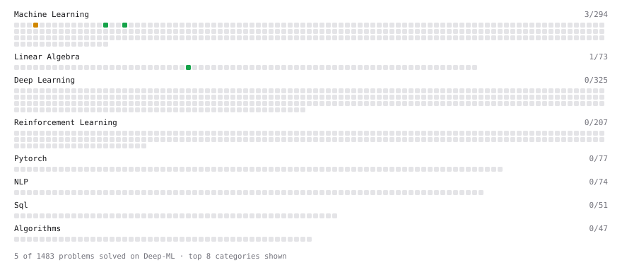

# Deep-ML

My machine learning practice from [Deep-ML](https://www.deep-ml.com). Every solution here was written by hand.

**6** solved · 6 problems · 0 labs · 0 math

[**Browse the interactive portfolio**](https://DanielUgoAli.github.io/deep-ml/) to replay this filling in over time.

## Problems

| | Difficulty | Solved | |
| --- | --- | --- | --- |
| [Calculate Accuracy Score](https://www.deep-ml.com/problems/36) | easy | 2026-09-29 | [solution](problems/0036-calculate-accuracy-score) |
| [Calculate Image Brightness](https://www.deep-ml.com/problems/70) | easy | 2026-09-29 | [solution](problems/0070-calculate-image-brightness) |
| [Derivative of a Polynomial](https://www.deep-ml.com/problems/116) | easy | 2026-09-29 | [solution](problems/0116-derivative-of-a-polynomial) |
| [Dot Product Calculator](https://www.deep-ml.com/problems/83) | easy | 2026-09-26 | [solution](problems/0083-dot-product-calculator) |
| [Linear Kernel Function](https://www.deep-ml.com/problems/45) | easy | 2026-09-29 | [solution](problems/0045-linear-kernel-function) |
| [K-Means Clustering](https://www.deep-ml.com/problems/17) | medium | 2026-09-29 | [solution](problems/0017-k-means-clustering) |

---

_This file is regenerated by Deep-ML on every push._
